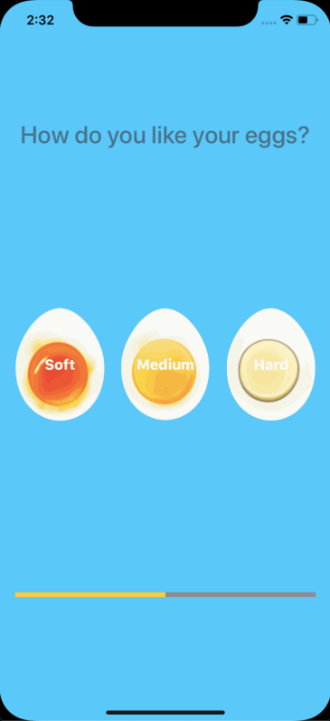

# EggTimer

It is a simple timer app, which has three timer options for a soft boil egg, medium boil egg, and hard boil egg and also uses an AVFoundation framework for showing the completion of timer. It is inspired by [Dr. Angela Yu of the course iOS 13 and Swift 5 - The Complete iOS App Development Bootcamp.](https://www.udemy.com/course/ios-13-app-development-bootcamp/?utm_source=adwords&utm_medium=udemyads&utm_campaign=iOSDevelopment_v.PROF_la.EN_cc.ROW_ti.6292&utm_content=deal4584&utm_term=_._ag_85479008314_._ad_395185983723_._kw__._de_c_._dm__._pl__._ti_dsa-774930045049_._li_1007710_._pd__._&matchtype=b)

